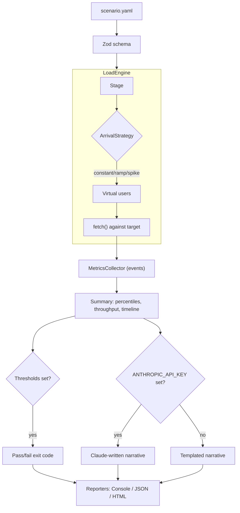

# Load Test Toolkit

[](https://github.com/urielabin/load-test-toolkit/actions/workflows/ci.yml)
[](LICENSE)

Declarative HTTP load testing from a YAML scenario file — real virtual-user engine, latency/throughput metrics, HTML/JSON reports, and CI-ready pass/fail thresholds. Core is fully local and free; an LLM-written run summary is an optional layer on top.

## Architecture



## Stack

| Layer | Technology |
|---|---|
| CLI | Commander |
| Config | YAML + Zod |
| Engine | Node.js `fetch`, event-driven virtual-user pool |
| Reports | Hand-rolled SVG charts (no chart library) |
| LLM (optional) | Claude via `@anthropic-ai/sdk` |
| Testing | Vitest (unit + real HTTP integration against a fixture server) |
| CI | GitHub Actions |

## Design patterns

- **Strategy** — `ArrivalStrategy` (constant / ramp / spike) decides requests/sec at any point in a stage
- **Factory** — `createArrivalStrategy` picks the strategy from scenario config
- **Observer** — `MetricsCollector` extends `EventEmitter`, emitting a `sample` event per request so reporters/live output can subscribe without coupling to the engine
- **Exporter** — `Reporter` interface with Console/JSON/HTML implementations

## Commands

```bash
npm install
npm run fixture-server   # optional local target to try scenarios against
npm run dev -- run scenarios/smoke.yaml --json report.json --html report.html
npm test
npm run lint
npm run typecheck
npm run build
```

## Scenario format

```yaml
name: checkout flow
baseUrl: https://api.example.com
requests:
  - method: GET
    path: /health
stages:
  - strategy: constant
    durationSeconds: 10
    arrivalRate: 5
  - strategy: ramp
    durationSeconds: 20
    arrivalRate: 5
    targetArrivalRate: 50
thresholds:
  p95LatencyMs: 300
  maxErrorRate: 0.01
```

`loadtest run` exits non-zero if any threshold is violated, so it can gate a CI pipeline. Set `ANTHROPIC_API_KEY` for a Claude-written narrative summary of the run; without it, a templated summary is used — the engine, metrics, and threshold gate are always free and local.
